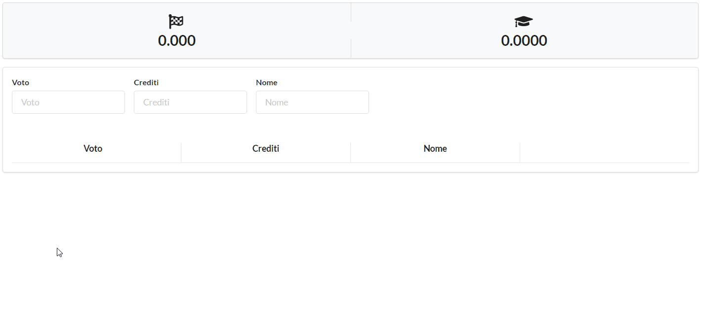

# Media

## Un libretto universitario interattivo

**Media** è una semplice web app con la funzione di tenere traccia del tuo percorso universitario.
È sviluppato in puro **React**, utilizzando **Express** come backend e salvando i dati in un database **SQLite**.

**Media** è pensato per un uso monoutente e senza autenticazione e permette di visualizzare in modo rapido ed interattivo la **media ponderata** ed il probabile **voto di laurea** di uno studente dato un elenco di esami con i relativi **voti** e **crediti**.

È un progetto giocattolo scritto in un paio di giorni per essere utilizzato da una sola persona.
Si presterebbe facilmente a diventare un'applicazione mobile, ipotesi che potrei considerare se dovessi finalmente decidere di imparare ad usare React Native.

## Utilizzo

L'utilizzo dovrebbe essere piuttosto intuitivo, con l'aggiunta di esami ed i voti che si aggiorneranno sullo schermo in tempo reale.

Gli esami aggiunti saranno aggiunti in via "temporanea" per permettere allo studente di testare eventuali futuri possibili senza rischiare di modificare i dati relativi agli esami effetivamente aggiunti. Per inserire definitivamente un esame nella lista in modo tale da conservarlo anche dopo aver ricaricato la pagina sarà sufficente salvare definitivamente l'esame con l'apposito pulsante.

## Note

Per eventuali domande o informazioni potete contattarmi al mio indirizzo mail **danielescarinci42 *(at)* gmail *(dot)* com**.
